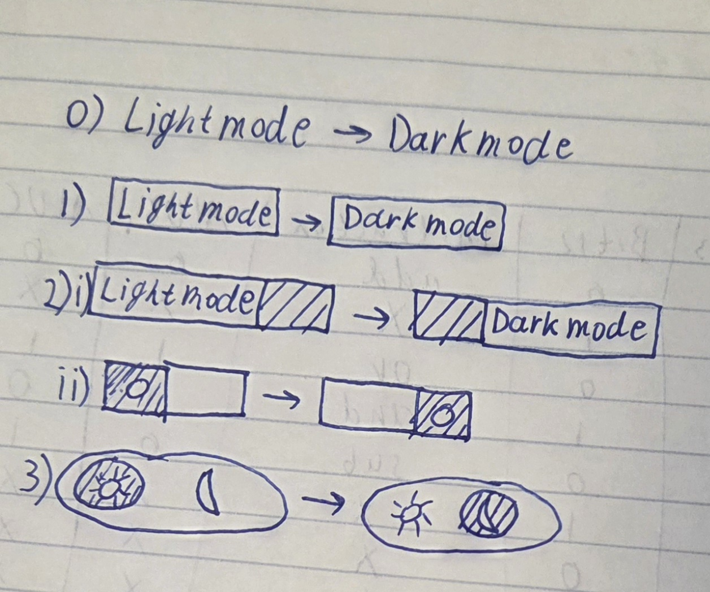
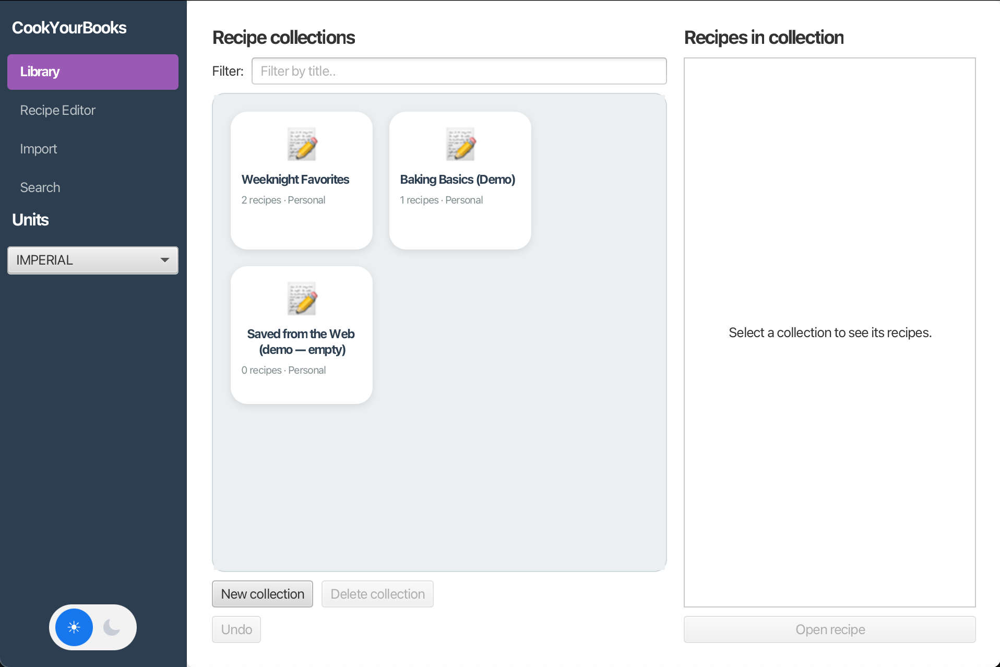
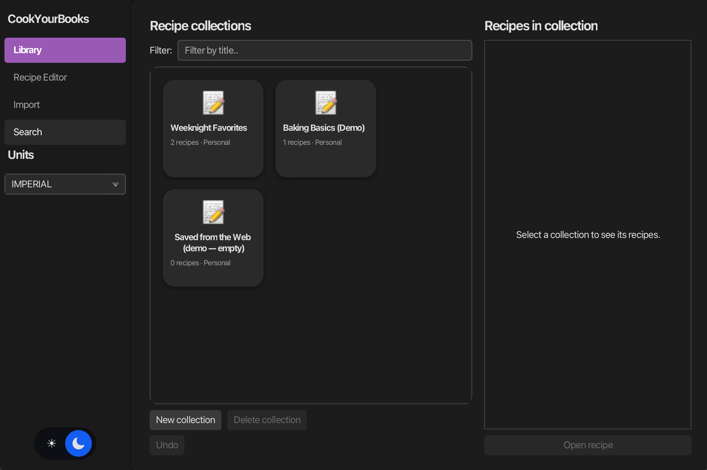

1. Design Rationale
User persona from GA0: Taylor Rodriguez, a college student who is renting her appartment and doesn't have constant access to school cafeteria. She wants to learn to cook moderately advanced dishes because in her culture cooking is valuable and she wants to learn to cook without going to culinary classes. She is capable to take a picture of a prepared dish and upload it anywhere. She is also capable to find a picture online, copy (or even save) and paste it wherever needed. Her goal is to broaden her standard cooking skills and learn to multitask and cook multiple different dishes at a time. Right now she is only able to cook simple dishes like eggs, grilled chicken with mashed potatoes, pasta marinara, or dishes that do not have multiple ingredients (like japanese rolls, beef wellington, or soups like borscht). She struggles with timings if she needs to prepare and interact with multiple ingredients at a time, and she also doesn't "feel" how much of each spices needs to be added, she must follow exact instructions or else gets lost or may add wrong quantity. She would always cook in her kitchen where she controls what she has, where everything is located, and how her stove works.

Why did we choose this feature + what user need  does it address: We chose this feature because students often stay late, on their phones, and we, as a college students who can relate to Taylor Rodriguez, definitely use and appreciate darkmode in pretty much any application. I, Konstantin, even downloaded an app that lowers my screen brightness below what I can do myself in settings. That feature helps avoid eye-damage for late night usage, but also some users prefer a darker layout, so this is also a cosmetic capability.

Alternatives we considered: We considered changing the general layout color to something less bright, more universal, but it doesn't look optimal, and ultimately a capability to switch between two versions is better than having a middle-ground version.

2. Design Artifacts

We first didn't think much about button cosmetic, since we focused first on implementing functionality. During functionality, we played with some different colors until choosing final version. We didn't sketch the colors because obviously it is easier to play with colors in the code, rather than imagine how it looks like on whiteboard.

Regarding the button/slider, zeroth iteration was just a clickable text. We implemented it first just to have a capability to test functionality of dark mode, to have an ability to switch between the two modes. We did that for internal development usage only, we knew this is not what we will let a user use.

After completing functionality and testing it works, we decided to try sketching a button and improve our sketch with each iterating.

First version: we tried having a button that says "lightmode" when in lightmode, and  "darkmode" when clicked and switched to darkmode. We think the text was offsetting a little. It didn't feel natural, and we think it wasn't too obvious for the user what the button does. It didn't seem right.

Second version: we then decided to try and do a slider. This now makes it obvious that this is an interactive button, and it changes from one state to another, like a binary operation. It should also be less scary since users know that they can return to the original state by clicking the slider again. Obviously, a slider either goes right or left only. It is not some obscure button that maybe is going to ask a user to potentially do something else. It is a simpler design that implies simpler change in state in a binary format, easy to return to original state if the result of the sliding button doesn't satisfy a user. We thought of retaining texts, "lightmode" when in lightmode, "darkmode" when in darkmode. When sketching it, we realized the text still looks ugly and you need to fit it in a relatively small button, so we needed to further improve our design. Not putting anything inside the slider is way too obscure, so that wouldn't work either.

Third, final version: For the final sketch we decided to use a sun and a moon to communicate with the user. Both sun and moon appear on the button, and it's obvious which one is selected right now. This is a very simple design, compact, not scary, and very self-explanatory.

3. Implementation Journal
Git history: we made sure we take incremental steps in the implementation of the feature.

PR History:
https://github.com/neu-cs3100/sp26-hw-cyb12-group-508/pull/2
https://github.com/neu-cs3100/sp26-hw-cyb12-group-508/pull/4
https://github.com/neu-cs3100/sp26-hw-cyb12-group-508/pull/5

Decision log: A key technical decision was how to implement the dark mode sliding button. One option was to use a standard JavaFX ToggleButton styled purely with CSS, but this limited the ability to create a smooth sliding animation and nice appearance.
Another option was to build a custom control button, which would provide maximum flexibility but require significantly more code and complexity.
The chosen approach was to use a ToggleButton with a custom graphic composed of a track, thumb, and icons, and animate the thumb using JavaFX transitions. That gave us good balance between flexibility and complexity.

4. Testing & Quality
We have unit tests for the feature
Known limitations: There are no known limitations.
Key navigation works.

5. Feature Summary
Screenshots:

Integration notes: The feature extends usability of the app and allows people to use the app when it's dark in the room. The feature also extends customizability for users, adds capability to choose a layout that is more pleasing to the eye (regardless if it's dark or not in the room)

Status: The feature is fully completed, polished, and doesn't have bugs.